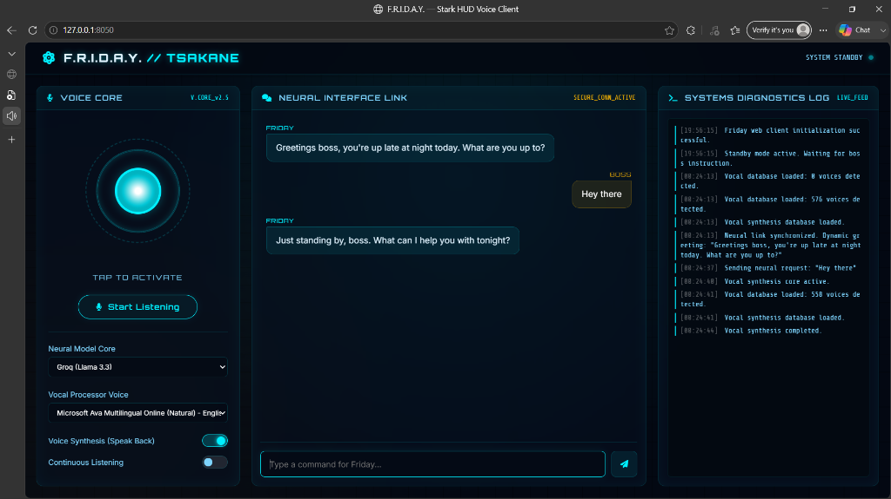

# F.R.I.D.A.Y. by Tsakane



F.R.I.D.A.Y. (Fully Responsive Intelligent Digital Assistant for You) is a custom, Tony Stark-inspired AI assistant evolved with multi-model brain cores, resilient failover routing, and rich speech synthesis control. It features both a desktop-based **LiveKit Voice Agent** and a sleek **FastAPI Web Client** with a real-time Systems Diagnostics console.

---

## Core Features (Current State)

### 🧠 Multi-Model Switcher (Neural Core)
You can dynamically hot-swap F.R.I.D.A.Y.'s reasoning core on the fly via the Web UI Settings panel. It supports:
*   **Groq** (Llama 3.3-70b-versatile) — *Default*
*   **Gemini** (Gemini 3.5 Flash)
*   **OpenAI** (GPT-4o)

### 🔄 Resilient Provider Fallover (LLM Chain)
Never worry about daily API rate limits (like Gemini 429 quota blocks) again. If your chosen model fails, F.R.I.D.A.Y. automatically reroutes the request in real time through the next available provider in the chain (e.g., falling back to Groq) and logs the failover warnings directly in the Systems Diagnostics Log.

### 🗣️ Phonetic Pronunciation Override
Custom speech synthesis rules ensure F.R.I.D.A.Y. speaks correctly:
*   **Spelling:** Displayed as **Tsakane** in all chat bubbles and transcriptions.
*   **Pronunciation:** Vocalized phonetically as **"Sekani"** across both the Web client's speech synthesis and the LiveKit streaming audio pipeline.

### 🌐 World Monitor Integration
F.R.I.D.A.Y. is connected to a live global intelligence system. Asking *"What's happening in the world?"* or *"Can you tell me what is going on around the world?"* triggers:
1.  A longer, more detailed news brief (5–7 sentences), specifically checking for news regarding **Zimbabwe** (falling back to *"no outstanding international news regarding Zimbabwe as of now"* if none is found).
2.  An immediate browser launch opening the **World Monitor** app configured directly with pre-selected layer filters (Conflicts, Bases, Hotspots, Nuclear, Sanctions, Weather, etc.).
3.  A conclusion cue: *"I have opened the world monitor app for you, boss"* while she continues speaking in the background.

---

## Project Structure

```text
friday-tony-stark-demo/
├── server.py           # Starts the FastMCP Tool Server (SSE on port 8000)
├── web_friday.py       # FastAPI web server backend (SSE client + REST APIs on port 8050)
├── agent_friday.py     # LiveKit voice agent script (WebRTC speech agent)
├── start.bat           # Unified launcher script
├── .env                # App API credentials and defaults
└── static/             # Web Client Frontend (HUD Interface)
    ├── index.html      # Stark HUD Interface and settings dropdowns
    ├── style.css       # Aesthetics and animations
    └── app.js          # Speech synthesis engine and diagnostics handler
```

---

## Quick Start

### 1. Prerequisites
*   Python ≥ 3.11
*   [`uv`](https://github.com/astral-sh/uv) (Python package runner)
*   Microsoft Edge (for the HUD display)

### 2. Launch F.R.I.D.A.Y.
Double-click or run the unified batch launcher:
```powershell
.\start.bat
```
This script will automatically:
1.  Fire up the **Friday MCP Tool Server** in a separate command window.
2.  Start the **Friday Web Client** server on `http://127.0.0.1:8050/`.
3.  Launch **Microsoft Edge** pointing directly to your HUD control interface.

---

## Configuration (`.env`)

Configure your API keys in the `.env` file at the project root:

```ini
# LLM Providers Configuration
OPENAI_API_KEY=your_openai_key
GROQ_API_KEY=your_groq_key
GOOGLE_API_KEY=your_gemini_key

# Default Brain Core Settings
LLM_PROVIDER=groq
STT_PROVIDER=whisper
TTS_PROVIDER=gemini-tts
```
